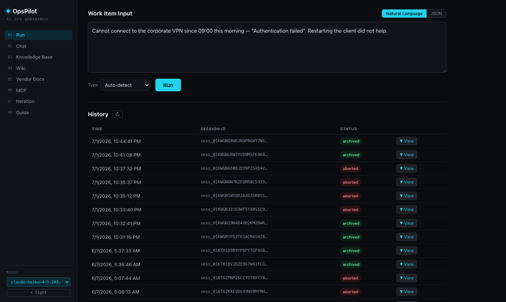
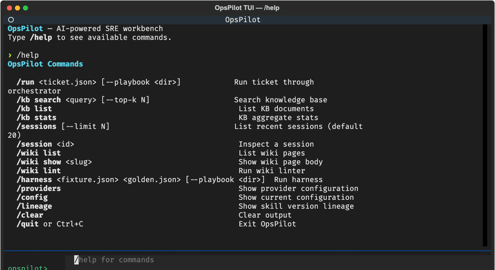
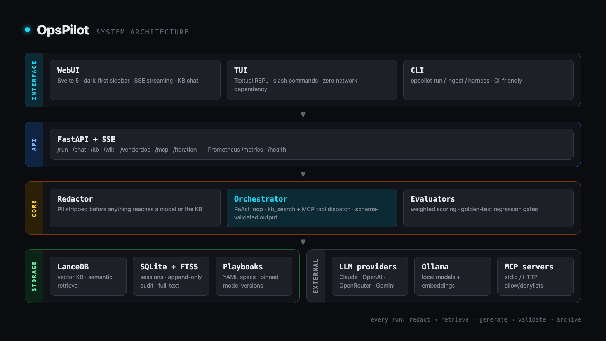
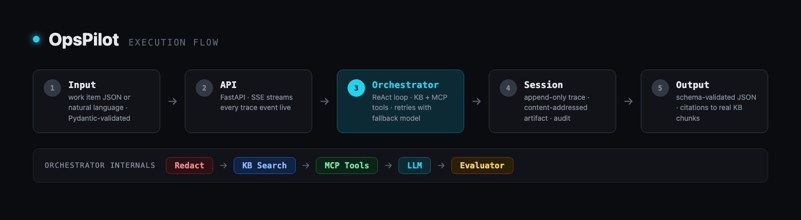

# OpsPilot

**AI-augmented IT ops workbench — spec-driven, multi-provider, local-first**

> 中文版：[README.zh-CN.md](./README.zh-CN.md)

OpsPilot turns raw IT work items — incidents, service requests, tasks — into
structured, KB-cited summaries through a playbook-driven AI pipeline. It runs
fully local with Ollama or against any major cloud provider, and every run
leaves an auditable trail: PII is redacted before anything reaches a model,
output is validated against a strict JSON Schema, and each session archives a
content-addressed artifact plus an append-only trace.

## Why this project

AI is reshaping the IT-support industry. OpsPilot is a working answer to a
concrete question: **given what today's LLMs can actually do, what does a
practical work-assistance layer for IT support look like?**

- Today's models are already good enough to draft incident summaries,
  decompose work into routable tasks, and pull up the right runbook — *if*
  every claim is grounded in a knowledge base and every run is auditable.
  That grounding and auditability is what OpsPilot builds.
- Model capability keeps compounding, and OpsPilot is built to ride that
  curve rather than chase it: playbooks pin model versions, a regression
  harness gates every upgrade, and the spec-driven contracts make adopting a
  stronger model a config change, not a rewrite.
- The human stays in charge: OpsPilot suggests severities, tiers, and
  actions; your system of record — and your engineers — make the decisions.

## Highlights

- **Multi-provider** — Anthropic Claude, OpenAI, OpenRouter, Gemini, or local
  Ollama; switch per-run from the UI; playbooks declare a primary model plus a
  local fallback (e.g. Claude → Gemma)
- **KB retrieval with citations** — hybrid vector (LanceDB) + full-text
  (SQLite FTS5) search fused with RRF; `tool` mode (ReAct) for strong models,
  `prefetch` injection for weak local ones
- **Redaction first** — PII stripped before any content reaches a model or
  the KB
- **Auditable sessions** — content-addressed artifacts, append-only traces,
  schema-validated output, browsable history
- **Sandboxed actions** — AI-proposed shell actions run in hardened Docker
  (L2) or gVisor (L3, fail-closed) containers; an approval gate flags risky
  patterns for human sign-off
- **Compounding wiki** — session insights distilled into lint-checked,
  lifecycle-managed wiki pages on top of the long-term KB
- **MCP client** — tools from any Model Context Protocol server (stdio/HTTP)
  injected into the ReAct loop, with per-server allow/denylists
- **Four interfaces + channels** — CLI, REPL terminal UI (Textual, slash
  commands), tabbed web UI (Svelte 5) with KB-augmented chat, FastAPI
  backend; Telegram channel brings the KB chat into your messenger
- **Observability** — Prometheus `/metrics`, OTel-compatible JSON logs,
  `/health`
- **Rust hot paths** — chunker (9.6×) and tokenizer (45×) compiled via
  PyO3/maturin, with transparent Python fallback

## A quick look

The web UI — dark-first, sidebar-navigated, every answer cited back to the KB:



The terminal UI — a REPL with slash commands over the same backend:



## Quick start

### Prerequisites

- Python 3.12+
- [Ollama](https://ollama.com) (for local models and embeddings)
- Node.js 18+ and [pnpm](https://pnpm.io) (for the web UI)

### 1. Clone and install

```bash
git clone https://github.com/vicenteliu/OpsPilot.git
cd OpsPilot
python -m venv .venv && source .venv/bin/activate
pip install -e ".[dev]"
```

Optional but recommended — Rust extensions (10–48× faster chunker/tokenizer;
requires [rustup](https://rustup.rs)):

```bash
make rust-dev
```

### 2. Pull models

```bash
ollama pull nomic-embed-text-v2-moe   # embedding model (required)
ollama pull gemma4:e4b                 # local chat model (optional fallback)
```

### 3. Configure

```bash
cp .env.example .env
# Edit .env — add ANTHROPIC_API_KEY or other cloud keys if using cloud providers
```

### 4. Ingest a knowledge base

```bash
# Sample English KB (SOPs and runbooks) shipped with the repo:
opspilot ingest examples/sample_data_en/kb/
# Or point it at your own directory of markdown/PDF/DOCX documents.
```

### 5. Run

```bash
opspilot tui                              # terminal UI workbench
opspilot serve --reload --with-ui         # API + web UI → http://localhost:5173
```

## Architecture





Every run: redact → retrieve → generate → validate against JSON Schema →
archive. See [docs/architecture.md](docs/architecture.md) for the full request
flow, the six-layer system design, provider routing, and retrieval modes.

## Documentation

| Document | Contents |
|---|---|
| [docs/architecture.md](docs/architecture.md) | Request flow, layer design, provider routing, retrieval modes |
| [docs/cli.md](docs/cli.md) | TUI, harness, sandbox, MCP, and wiki command reference |
| [docs/deployment.md](docs/deployment.md) | Docker Compose, systemd, observability, configuration |
| [docs/channels.md](docs/channels.md) | Messaging channels — Telegram assist-mode setup |
| [docs/specs/](docs/specs/) | Spec contracts: schemas + templates (loaded at runtime) |
| [docs/adr/](docs/adr/) | Architecture decision records |
| [ROADMAP.md](ROADMAP.md) | Direction: remote access foundation, Channels, mobile companion |
| [CONTRIBUTING.md](CONTRIBUTING.md) | Dev setup, quality gates, PR conventions |
| [SECURITY.md](SECURITY.md) | Deployment model, threat model, reporting vulnerabilities |

## Safety

- OpsPilot is **single-user**; local use needs no auth, and remote binding
  is fail-closed — it requires a bearer token, plus TLS in front
  ([ADR-0011](docs/adr/0011-remote-access-bearer-token-proxy-tls.md),
  [SECURITY.md](SECURITY.md))
- The redaction layer strips PII from structured work items, but always
  sanitize manually before pasting content into any model or tool
- Cloud API keys are resolved from environment variables — never committed
- Session traces stay local in `~/.opspilot/sessions/`

## License

MIT
