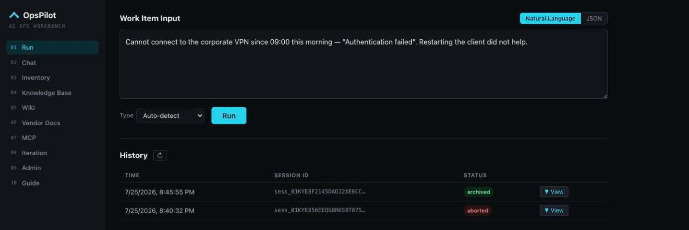
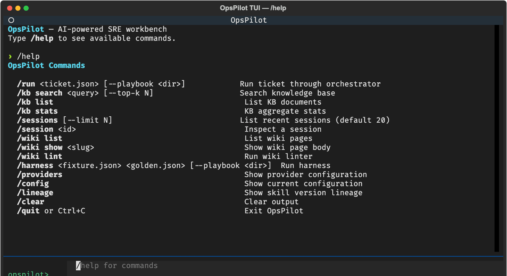
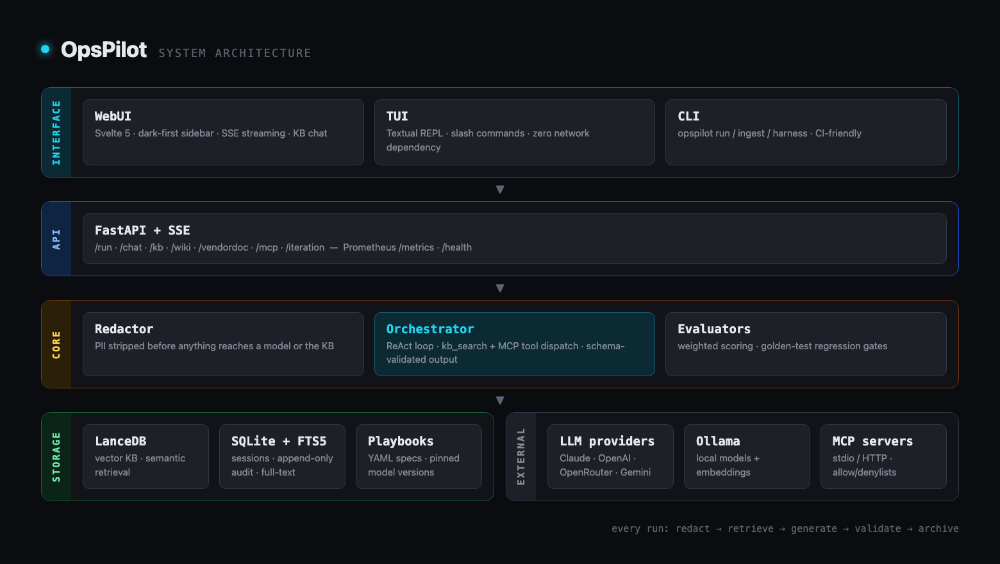
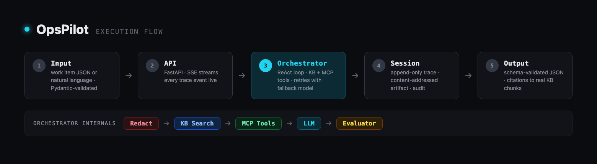

<h1>
  <picture>
    <source media="(prefers-color-scheme: dark)" srcset="docs/assets/logo-on-dark.svg">
    
  </picture>&nbsp; OpsPilot
</h1>

**AI 增强的 IT 运维工作台 —— 规格驱动、多模型、多用户、本地优先**

[](https://github.com/vicenteliu/OpsPilot/actions/workflows/ci.yml)
[](pyproject.toml)
[](LICENSE)

> English: [README.md](./README.md)
>
> 本文是英文 README 的翻译版本；两者不一致时以英文版为准。

OpsPilot 通过 playbook 驱动的 AI 管线，把原始 IT 工作项（Work item）——事件
（Incident）、服务请求（Service Request）、任务（Task）——转化为结构化、带知识库
引用的建议，并与你已有的工具形成闭环：自动从 Jira Service Management 轮询
新工单并把建议以评论的形式发回工单，也可以在 Telegram 里用一条命令把消息
立为工作项。它既可以用 Ollama 完全本地运行，也可以接入各大云端模型；每次
运行都留下可审计的痕迹：内容到达模型之前先做 PII 脱敏，输出经过严格 JSON
Schema 校验，每个会话归档一份内容寻址的 artifact 和一条只追加的 trace。

## 项目初衷

AI 正在重塑整个 IT Support 行业。OpsPilot 是对一个具体问题的可运行回答：
**基于当下 LLM 的真实能力，一套实用的 IT Support 工作辅助层应该长什么样？**

- 今天的模型已经足以起草事件摘要、把工作拆解为可派发的任务、找到对的
  runbook——前提是每个结论都有知识库依据、每次运行都可审计。这份依据和
  可审计性正是 OpsPilot 构建的东西。
- 模型能力在持续复利式增长，OpsPilot 的设计是顺着这条曲线走而不是追赶它：
  playbook 锁定模型版本、回归 harness 把关每次升级、规格驱动的契约让换用
  更强的模型只是一次配置变更而非重写。
- 人始终掌握决定权：OpsPilot 只建议严重度、支持线和处置动作；你的工单系统
  和工程师做最终决定。

## 亮点

- **多模型支持** —— Anthropic Claude、OpenAI、OpenRouter、Gemini、xAI Grok
  或本地 Ollama；playbook 声明主模型 + 可选备选模型（含本地 Gemma），可在 UI
  按次切换、也可在后台设团队默认，provider 出错时自动降级；管理员还能在后台
  直接编辑 playbook 的可选模型列表（增删、升级模型名）。嵌入默认走本地
  Ollama，Ollama 不可用时回退到 OpenAI（并显著提示）
- **工单接入（Intake）** —— 按 JQL 范围直接从 Jira Service Management 拉取
  工单，AI 建议以评论形式发回工单本身：纯轮询（无需公网入口）、只发评论
  （绝不改动字段）、状态可跨重启保留，还有 `--replay` 模式离线演示完整闭环；
  接入管道可以指定比交互使用更便宜的模型，远程部署也可改用
  `POST /api/intake` 推送接入
- **带引用的知识库检索** —— 向量（LanceDB）+ 全文（SQLite FTS5）混合搜索，
  RRF 融合；强模型走 `tool` 模式（ReAct），弱本地模型走 `prefetch` 注入
- **脱敏优先** —— 任何内容进入模型或知识库之前先剥离 PII
- **可审计会话** —— 内容寻址 artifact、只追加 trace、schema 校验输出、可
  浏览的历史记录
- **沙箱化动作执行** —— AI 提议的 shell 动作在加固 Docker（L2）或 gVisor
  （L3，fail-closed）容器中运行；审批门对危险模式标记要求人工签核
- **复利式 wiki** —— 会话洞见蒸馏为经过 lint 检查、有生命周期管理的 wiki
  页面，沉淀在长期知识库之上
- **MCP 客户端** —— 任意 Model Context Protocol 服务器（stdio/HTTP）的工具
  注入 ReAct 循环，按服务器配置允许/拒绝列表
- **界面与渠道** —— CLI、REPL 终端 UI（Textual，斜杠命令）、多标签
  Web UI（Svelte 5，含知识库增强聊天）、FastAPI 后端；Telegram 渠道把知识库
  问答带进你的聊天软件，还能用 `/intake` 直接立工作项；企业微信双向接入——
  群机器人推送收单建议（通知模式），自建应用在聊天里回答知识库问题（对话模式）
- **多用户与 SSO** —— 登录门控的 Web UI，三种角色（viewer / operator /
  admin）；本地账号、LDAP / Active Directory 或 OIDC SSO 认证，支持组→角色
  映射，后台模块管理用户/角色/认证源状态/审计。机器调用方（渠道、收单）走
  Service token；密钥只在环境变量、绝不入库。打包为 all-in-one Docker 镜像——
  一条 `docker run` 就是带登录的完整工作台
- **可观测性** —— Prometheus `/metrics`、OTel 兼容 JSON 日志、`/health`
- **Rust 热路径** —— 分块器（~10×）和分词器（~45×）经 PyO3/maturin 编译，
  纯 Python 透明降级；CI 门槛 ≥5×

## 一览

Web UI —— 暗色优先、侧边栏导航，每个回答都能溯源到知识库：



终端 UI —— 同一后端之上的斜杠命令 REPL：



## 快速开始

### 前置条件

- Python 3.12+
- [Ollama](https://ollama.com)（本地模型与向量嵌入）
- Node.js 18+ 与 [pnpm](https://pnpm.io)（Web UI 需要）

### 1. 克隆与安装

```bash
git clone https://github.com/vicenteliu/OpsPilot.git
cd OpsPilot
python -m venv .venv && source .venv/bin/activate
pip install -e ".[dev]"
```

可选但推荐 —— Rust 扩展（分块/分词提速 ~10–45×；需要
[rustup](https://rustup.rs)）：

```bash
make rust-dev
```

### 2. 拉取模型

```bash
ollama pull nomic-embed-text-v2-moe   # 嵌入模型（必需）
ollama pull gemma4:e4b                 # 本地对话模型（可选 fallback）
```

### 3. 配置

```bash
cp .env.example .env
# 编辑 .env —— 使用云端模型时填入 ANTHROPIC_API_KEY 等。
# 没有云端 key？在 UI 下拉框选择本地 Gemma 模型即可——检索会自动切到
# prefetch 模式，弱模型也能正确引用知识库。
```

### 4. 摄取知识库

```bash
# 仓库自带的英文示例知识库（SOP 与 runbook）：
opspilot ingest examples/sample_data_en/kb/
# 也可以指向你自己的 markdown/PDF/DOCX 文档目录。
```

### 5. 运行

```bash
opspilot tui                              # 终端 UI 工作台
opspilot serve --reload --with-ui         # API + Web UI → http://localhost:5173
```

再离线看一遍完整的工单接入闭环——不需要任何工单系统：

```bash
opspilot source jsm --replay tests/fixtures/jsm_replay/
cat intake_comments/IT-101.md             # 真实工单会收到的那条建议
```

跑起来之后：在 **Run** 标签提交工单、在 **Chat** 标签向知识库提问，接入
[Telegram 渠道](docs/channels.md)在手机上与知识库对话（或用 `/intake` 立
工作项），或把接入指向你的
[Jira Service Management 项目](docs/sources.md)——免费版站点约十分钟接通，
新工单就会自动获得摘要和评论。

### 或：单容器（all-in-one）

镜像已内置构建好的 Web UI，一个容器即带登录的完整工作台
（见 [docs/deployment.md](docs/deployment.md)）：

```bash
docker build -t opspilot:latest .
docker run -p 8000:8000 \
  -e OPSPILOT_API_TOKEN="$(openssl rand -hex 32)" \
  -e OPSPILOT_BOOTSTRAP_ADMIN=admin -e OPSPILOT_BOOTSTRAP_PASSWORD='<强密码>' \
  -e ANTHROPIC_API_KEY=sk-ant-... \
  -e OPSPILOT_OLLAMA_BASE_URL=http://host.docker.internal:11434 \
  -v opspilot-data:/home/opspilot/.opspilot \
  opspilot:latest serve --host 0.0.0.0 --port 8000
# → http://localhost:8000，以 bootstrap 管理员登录
```

## 架构





每次运行：脱敏 → 检索 → 生成 → JSON Schema 校验 → 归档。完整请求流、六层
系统设计、模型路由与检索模式见
[docs/architecture.md](docs/architecture.md)（英文）。

## 文档

| 文档 | 内容 |
|---|---|
| [docs/architecture.md](docs/architecture.md) | 请求流、分层设计、模型路由、检索模式 |
| [docs/cli.md](docs/cli.md) | TUI、harness、沙箱、MCP、wiki 命令参考 |
| [docs/deployment.md](docs/deployment.md) | Docker Compose、systemd、可观测性、配置 |
| [docs/channels.md](docs/channels.md) | 消息渠道 —— Telegram 接入：知识库问答 + `/intake` 立单 |
| [docs/sources.md](docs/sources.md) | 工单接入 —— JSM 接通、replay 模式、状态与重跑 |
| [docs/specs/](docs/specs/) | 规格契约：schema + 模板（运行时加载） |
| [docs/adr/](docs/adr/) | 架构决策记录 |
| [docs/zh/design/](docs/zh/design/) | 历史设计文档（中文，不再维护） |
| [ROADMAP.md](ROADMAP.md) | 方向：移动伴侣、语音输入 |
| [CONTRIBUTING.md](CONTRIBUTING.md) | 开发环境、质量门、PR 约定 |
| [SECURITY.md](SECURITY.md) | 部署模型、威胁模型、漏洞报告 |

## 安全

- **多用户、三角色**（viewer / operator / admin）：本地账号、LDAP/AD 或
  OIDC SSO。本地回环开发无摩擦；非回环绑定 fail-closed（必须配 token 并在
  前面加 TLS）；机器调用方走 Service token
  （[ADR-0020](docs/adr/0020-multi-user-auth-three-roles-three-sources.md)、
  [ADR-0011](docs/adr/0011-remote-access-bearer-token-proxy-tls.md)、
  [SECURITY.md](SECURITY.md)）
- **密钥只在环境变量** —— 云端 API key、LDAP/OIDC 凭据一律从环境变量读取，
  绝不提交入库、也不存数据库；后台只显示状态，不显示密钥
- 脱敏层处理结构化工作项中的 PII，但向任何模型或工具粘贴内容前请务必先
  手动清理
- 会话 trace 与全部状态保存在本地 `~/.opspilot/`

## 许可证

[Apache-2.0](LICENSE)
